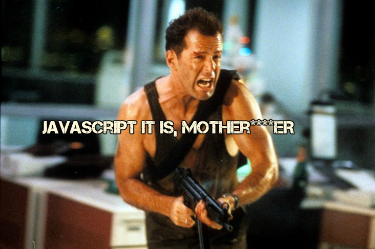
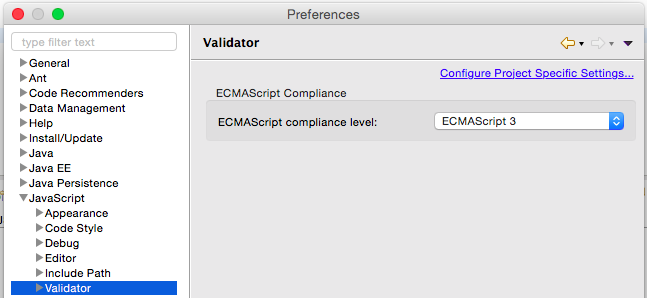

# javascript-for-diehard-java-devs

If you are a full-stack engineer like me, you may have purposefully avoided any form of JavaScript development for over a decade. 

The logic behind the avoidance is that it's hard enough to master and keep up with Java, and if you're a client-side consultant, you have to put up 
with all kinds of client-side matters to boot (including stack changes with each project). Moreover, with top-notch frameworks such as 
[Vaadin](http://www.vaadin.com) as the front-end arrow in your quiver, it becomes hard to devote one's free time to JavaScript and the 
potential for browser incompatibility burn. Even worse, if you are a full-stack developer, this implies mastering say bash, cloud computing 
and much more.

Well, times have changed in recent years, and some of the key developments that have convinced me that it's ill-advised to keep dodging JavaScript 
include:

* [Reactive Design Patterns](https://www.manning.com/books/reactive-design-patterns) and the accompanying [Reactive Manifesto](http://www.reactivemanifesto.org).
* The Model-View-ViewModel Architectural Pattern (MVVM) and supporting frameworks (e.g. [AngularJS](https://angularjs.org)).
* [Service Oriented Front End Architecture](http://www.smart-soft.com/downloads/articles/sofea.html) (SOFEA).

So, on with mastering JavaScript, even as a diehard Java developer.

## Tooling

It naturally be handy to keep on using familiar and mature tools while working through books and exercises. So that is what I've done while noting the need to keeping explore new tools that may have superior JavaScript support (e.g. Microsoft Visual Studio Code), if at all possible. 

### Eclipse 

Individual .js files can be executed on Eclipse Mars Java EE Edition and the JDK 8 Oracle Nashorn JavaScript Engine using the setup shown in the image below. Its also worth taking note of the Maven javascript-quickstart archetype and thinking 
that went into it.

Just note that you'll be using the print function and not console.log when running scripts using JJS.

By default, JavaScript Development Tools gives you ECMAScript 3 as the only viable compliance level, as shown below.

As a bare minimum I would want ECMAScript 5 as the compliance level. To make this happen either install Tern Eclipse IDE or say AngularJS Eclipse (which has the former as a dependency).

### Visual Studio (VS) Code

"**I said Goddamn**" (*Mia Wallace, Pulp Fiction*). 

These words and scene from Pulp Fiction succinctly sums up my first impression of programming JavaScript in VS Code, add to that the joy of 
working on a MacBook and your pretty much on an instantaneous high.   

## Booking

There are a plethora of books out there, chances are I'll buy a couple in time. That said, the starting point I've chosen
is [Eloquent JavaScript, 2nd Edition]() and to just skim over the entry-level programmer parts.

### Eloquent JavaScript, 2nd Edition

ECMAScript 5 as the basis (by deduction since the let keyword is specified as a future language improvement).

### Mozilla Developer Network JavaScript Guide

### Effective JavaScript

### Secrets of the JavaScript Ninja, Second Edition

